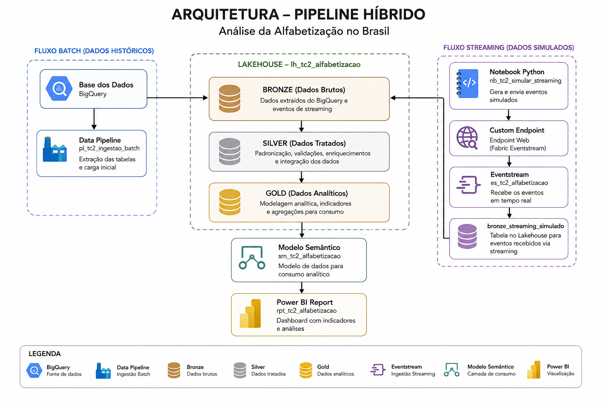

# Tech Challenge - Fase 2
## Pipeline Híbrido para Análise da Alfabetização no Brasil

Projeto desenvolvido para o Tech Challenge da Fase 2 da Pós-Tech
AI Scientist da FIAP.

A solução implementa uma arquitetura de dados em nuvem para ingestão,
processamento e análise dos indicadores de alfabetização no Brasil,
combinando processamento Batch e Streaming em uma arquitetura Medalhão.

## 1. Objetivo

Construir um pipeline de dados híbrido capaz de processar dados históricos
de alfabetização e simular a ingestão contínua de novos indicadores,
disponibilizando dados tratados para análise e visualização.

A solução contempla:

- ingestão Batch de dados históricos;
- simulação de ingestão Streaming;
- organização dos dados nas camadas Bronze, Silver e Gold;
- controles de qualidade e consistência;
- monitoramento do processamento e consumo de recursos;
- análise de custos sob a perspectiva de FinOps;
- disponibilização dos resultados para análise no Power BI.

## 2. Fonte de Dados

Os dados utilizados são provenientes do conjunto
**Avaliação da Alfabetização**, disponibilizado pela Base dos Dados a
partir de informações do INEP.

O conjunto contém informações referentes à avaliação da alfabetização
no Brasil, incluindo dados de alunos, municípios, unidades federativas
e metas de alfabetização.

As principais entidades utilizadas foram:

- alunos;
- município;
- UF;
- metas de alfabetização do Brasil;
- metas de alfabetização por UF;
- metas de alfabetização por município;
- dicionário de dados.

Também foi utilizada a tabela de diretórios de municípios da Base dos
Dados para enriquecimento das informações geográficas, permitindo
associar aos identificadores municipais atributos como município,
UF e região.

A ingestão dos dados históricos é realizada diretamente do BigQuery
da Base dos Dados.

## 3. Arquitetura da Solução

A solução foi implementada no **Microsoft Fabric**, utilizando uma capacidade
F2 e adotando uma arquitetura híbrida de processamento de dados, composta
por fluxos Batch e Streaming.

### Fluxo Batch

O processamento Batch é responsável pela ingestão e transformação dos dados
históricos oficiais de alfabetização.

O fluxo implementado é:

Base dos Dados / BigQuery  
→ Data Pipeline  
→ Lakehouse / Bronze  
→ Notebooks PySpark  
→ Silver  
→ Gold  
→ Power BI

O Data Pipeline realiza a ingestão das tabelas disponibilizadas no BigQuery
e persiste os dados brutos no Lakehouse.

A partir da Bronze, notebooks PySpark executam as etapas de validação,
padronização, enriquecimento e transformação necessárias para geração das
camadas Silver e Gold.

### Fluxo Streaming

O processamento Streaming foi implementado como prova de conceito para
simular a chegada contínua de novos indicadores de alfabetização.

O fluxo implementado é:

Notebook Python  
→ Custom Endpoint  
→ Fabric Eventstream  
→ Lakehouse / Bronze

Foram simulados eventos contendo novos resultados municipais de
alfabetização. Os eventos são enviados ao endpoint do Eventstream,
processados em tempo real e persistidos na tabela
`bronze_streaming_simulado`.

Os dados simulados permanecem separados dos dados históricos oficiais,
evitando interferência nas análises produzidas pelas camadas Silver e Gold.

### Arquitetura Medalhão

O Lakehouse `lh_tc2_alfabetizacao` centraliza o armazenamento da solução,
organizado segundo a arquitetura Medalhão:

- **Bronze:** preservação dos dados ingeridos da fonte e dos eventos de
  streaming;
- **Silver:** dados tratados, validados, padronizados e enriquecidos;
- **Gold:** estruturas analíticas orientadas às perguntas de negócio e ao
  consumo pelo Power BI.

Essa separação permite preservar a rastreabilidade dos dados desde a origem
até as estruturas utilizadas para análise.

### Diagrama da Arquitetura

## 4. Tecnologias Utilizadas

A solução foi construída utilizando os seguintes componentes:

| Tecnologia / Serviço | Utilização |
|---|---|
| Microsoft Fabric | Plataforma cloud utilizada para implementação da solução |
| OneLake | Camada de armazenamento central do Microsoft Fabric |
| Fabric Lakehouse | Armazenamento das camadas Bronze, Silver e Gold |
| Data Pipeline | Orquestração da ingestão Batch |
| Fabric Notebooks | Processamento e transformação dos dados |
| Apache Spark / PySpark | Validação, transformação e enriquecimento dos dados |
| Delta Lake | Formato das tabelas das camadas Silver e Gold |
| Parquet | Formato utilizado na persistência dos dados Batch na Bronze |
| Fabric Eventstream | Ingestão dos eventos simulados em Streaming |
| Python | Simulação e envio dos eventos para o endpoint do Eventstream |
| BigQuery | Origem dos dados históricos disponibilizados pela Base dos Dados |
| SQL Analytics Endpoint | Disponibilização das tabelas do Lakehouse para consultas SQL |
| Fabric Capacity Metrics | Monitoramento do consumo de capacidade, utilização de recursos e armazenamento para análise de FinOps |
| Power BI | Construção do dashboard analítico |
| Git | Versionamento dos artefatos do projeto |

## 5. Pipeline Batch

A ingestão dos dados históricos é realizada pelo Data Pipeline
`pl_tc2_ingestao_batch`.

O pipeline consulta diretamente as tabelas públicas disponibilizadas no
BigQuery pela Base dos Dados e persiste os dados na camada Bronze do
Lakehouse.

Para reduzir repetição e facilitar a manutenção, a ingestão das principais
tabelas foi parametrizada por meio de uma atividade `ForEach`.

São ingeridas as seguintes tabelas do conjunto de dados de alfabetização:

- `alunos`;
- `dicionario`;
- `municipio`;
- `uf`;
- `meta_alfabetizacao_brasil`;
- `meta_alfabetizacao_uf`;
- `meta_alfabetizacao_municipio`.

Também é ingerida a tabela `municipio` do conjunto de Diretórios Brasileiros
da Base dos Dados, utilizada posteriormente para enriquecimento geográfico.

Os arquivos são armazenados em formato Parquet na camada Bronze, preservando
os dados provenientes da fonte antes das transformações realizadas nas
camadas posteriores.

## 6. Pipeline Streaming

O processamento Streaming foi implementado como uma prova de conceito para
demonstrar a ingestão contínua de novos indicadores de alfabetização.

A simulação é realizada pelo notebook `nb_tc2_simular_streaming`, que produz
eventos representando a chegada de novos resultados municipais de
alfabetização.

Cada evento contém informações como:

- ano;
- identificador do município;
- rede de ensino;
- taxa de alfabetização;
- tipo do evento.

Os eventos são enviados para um **Custom Endpoint** e recebidos pelo
`es_tc2_alfabetizacao`, implementado com Fabric Eventstream.

O fluxo utilizado é:

Notebook Python  
→ Custom Endpoint  
→ Fabric Eventstream  
→ Lakehouse  
→ `bronze_streaming_simulado`

Como validação da prova de conceito, foram enviados eventos simulados que
foram recebidos e processados pelo Eventstream e posteriormente persistidos
no Lakehouse.

Os dados simulados são mantidos separados dos dados oficiais utilizados no
processamento Batch. Dessa forma, a implementação demonstra a arquitetura
híbrida sem introduzir dados fictícios nas análises oficiais do projeto.

Por se tratar de uma prova de conceito acadêmica, optou-se por não propagar
os eventos simulados para as camadas Silver e Gold. Em um cenário produtivo,
o mesmo fluxo poderia ser estendido para incorporar os novos registros às
camadas analíticas após as respectivas validações de qualidade.

## 7. Arquitetura Medalhão

A organização dos dados segue a arquitetura Medalhão, separando as etapas de
ingestão, tratamento e consumo em camadas Bronze, Silver e Gold.

### 7.1 Bronze

A camada Bronze preserva os dados recebidos das fontes antes da aplicação das
regras de transformação e negócio.

Os dados históricos provenientes do BigQuery são armazenados em formato
Parquet, mantendo separação por entidade de origem.

Também fazem parte da Bronze:

- o dicionário de dados da fonte, utilizado como referência para interpretação
  e enriquecimento dos domínios;
- o diretório de municípios utilizado para enriquecimento geográfico;
- a tabela `bronze_streaming_simulado`, que recebe os eventos provenientes do
  Eventstream.

A preservação da camada de origem permite rastreabilidade e possibilita
reprocessamentos sem necessidade de nova extração da fonte.

### 7.2 Silver

A camada Silver concentra as operações de qualidade, padronização,
enriquecimento e integração dos dados.

As transformações são executadas principalmente pelo notebook
`nb_tc2_bronze_to_silver`, utilizando PySpark.

Entre os tratamentos realizados estão:

- validação de chaves candidatas e duplicidades;
- análise e tratamento semântico de valores nulos;
- validação dos domínios categóricos;
- padronização dos tipos de dados;
- validação da consistência entre proficiência e classificação de
  alfabetização;
- enriquecimento das descrições de domínio a partir do dicionário;
- enriquecimento geográfico dos municípios;
- normalização das metas municipais para estrutura longitudinal.

A regra de classificação da alfabetização foi validada considerando o ponto
de corte de 743 pontos. Os registros disponíveis apresentaram consistência
entre a proficiência e o indicador de alfabetização.

Valores nulos não foram substituídos automaticamente por zero. Nos dados de
alunos, por exemplo, a ausência de proficiência e peso é semanticamente válida
quando o aluno está ausente ou não possui prova preenchida.

O dicionário de dados permanece fisicamente na Bronze e é utilizado como
referência durante as transformações, evitando a criação de uma cópia Silver
sem necessidade analítica.

Foi criada também a tabela `silver_meta_municipio_long`, transformando as metas
originalmente distribuídas em colunas de 2024 a 2030 para uma estrutura
longitudinal:

`id_municipio + ano_meta + meta_alfabetizacao`

Essa estrutura facilita comparações temporais entre resultados observados e
metas correspondentes.

### 7.3 Gold

A camada Gold contém estruturas orientadas diretamente às perguntas analíticas
do projeto e ao consumo pelo Power BI.

Foram construídas três tabelas principais:

| Tabela | Finalidade |
|---|---|
| `gold_indicador_municipio` | Disponibilizar os indicadores oficiais de alfabetização por município e ano |
| `gold_meta_vs_resultado` | Comparar o resultado observado com a meta correspondente |
| `gold_evolucao_alfabetizacao` | Analisar a evolução da alfabetização entre 2023 e 2024 |

A `gold_meta_vs_resultado` preserva municípios sem meta disponível,
classificando-os explicitamente como `Sem meta`, evitando a exclusão
silenciosa desses registros.

A `gold_evolucao_alfabetizacao` calcula a variação em pontos percentuais entre
2023 e 2024 e classifica os municípios em `Melhora`, `Piora`, `Estável` ou
`Sem comparação`.

As tabelas Gold são disponibilizadas ao modelo semântico do Power BI,
reduzindo a necessidade de transformações adicionais na camada de
visualização.

## 8. Qualidade e Governança dos Dados

A qualidade dos dados é tratada durante o processamento da camada Silver,
com validações incorporadas aos notebooks de transformação.

As principais verificações realizadas incluem:

- validação de duplicidades e chaves candidatas;
- identificação de valores nulos;
- validação dos domínios categóricos;
- consistência entre proficiência e classificação de alfabetização;
- validação da integridade dos identificadores utilizados nos relacionamentos;
- análise da cobertura dos dados entre diferentes períodos e fontes.

Os valores nulos são tratados de acordo com seu significado no domínio,
evitando substituições automáticas que possam alterar a interpretação dos
dados.

Durante as análises também foram identificadas diferenças de cobertura entre
resultados e metas municipais. Esses registros foram preservados e
explicitamente identificados nas estruturas analíticas, permitindo que
limitações da fonte permaneçam visíveis ao consumidor dos dados.

### Governança

A governança da solução é apoiada pela separação das responsabilidades entre
as camadas da arquitetura Medalhão:

- **Bronze:** preservação e rastreabilidade dos dados de origem;
- **Silver:** aplicação das regras de qualidade, padronização e integração;
- **Gold:** disponibilização de estruturas orientadas ao consumo analítico.

Os nomes dos artefatos seguem um padrão que identifica sua função, como
`pl_` para pipelines, `nb_` para notebooks, `es_` para Eventstream e os
prefixos `silver_` e `gold_` para as respectivas camadas de dados.

Os dados simulados utilizados na prova de conceito de Streaming são mantidos
separados dos dados oficiais, impedindo sua utilização acidental nas análises.

Também foi adotado o princípio de minimização de dados, mantendo apenas os
atributos necessários às análises e utilizando identificadores técnicos nos
dados de alunos, sem introdução de informações pessoais adicionais.

## 9. Monitoramento e FinOps

O monitoramento da solução é realizado utilizando os recursos nativos do
Microsoft Fabric.

As execuções do pipeline Batch podem ser acompanhadas pelo histórico de
execução do Data Pipeline, enquanto o Fabric Eventstream disponibiliza
informações sobre o recebimento, processamento e persistência dos eventos
de Streaming.

Para acompanhamento do consumo da plataforma foi utilizado o
**Fabric Capacity Metrics**, permitindo analisar utilização da capacidade,
consumo computacional e armazenamento da solução.

### Capacidade

O ambiente utilizado no projeto foi executado em uma capacidade
**Microsoft Fabric F2**.

Durante o período analisado, a capacidade apresentou utilização média
próxima de 64%, sem ocorrência de throttling ou operações rejeitadas.

### Consumo computacional

A análise das métricas demonstrou que os notebooks Spark representam o
principal componente de consumo computacional da solução.

O maior consumo foi observado no notebook responsável pelo processamento
Bronze → Silver, etapa que concentra as principais operações de qualidade,
transformação e enriquecimento e processa aproximadamente 3,8 milhões de
registros da entidade de alunos.

Pipeline, Eventstream e Lakehouse apresentaram consumo significativamente
inferior ao processamento Spark.

Esse comportamento reforça a importância de evitar reprocessamentos
desnecessários e executar as transformações Spark apenas quando necessário.

### Armazenamento

O armazenamento da solução no OneLake permaneceu reduzido, com
aproximadamente **0,17 GB** utilizados no momento da análise.

### Estratégias de otimização

As principais decisões adotadas sob a perspectiva de FinOps foram:

- utilização de um único Lakehouse para as camadas Bronze, Silver e Gold;
- utilização de processamento Batch para os dados históricos;
- utilização do Streaming apenas para eventos incrementais;
- execução dos notebooks Spark sob demanda;
- armazenamento dos dados Bronze em formato Parquet;
- utilização de tabelas Delta nas camadas Silver e Gold;
- criação de estruturas Gold orientadas ao consumo, reduzindo transformações
  repetitivas na camada de visualização;
- evitar componentes adicionais sem necessidade funcional ou analítica.

O acompanhamento do consumo permitiu identificar o processamento Spark como
principal ponto de atenção para otimizações futuras.

## 10. Visualização dos Dados

Os dados da camada Gold são disponibilizados para consumo por meio de um
modelo semântico no Microsoft Fabric e visualizados utilizando o Power BI.

O relatório `rpt_tc2_alfabetizacao` foi construído com foco nas principais
perguntas analíticas do projeto, evitando transformações adicionais na
camada de visualização.

O dashboard apresenta:

- quantidade de municípios analisados;
- quantidade de municípios que apresentaram melhora entre 2023 e 2024;
- quantidade de municípios que atingiram a meta de alfabetização em 2024;
- quantidade de municípios sem meta disponível em 2024;
- distribuição dos municípios segundo o atingimento da meta;
- evolução da alfabetização entre 2023 e 2024;
- municípios com maior evolução em pontos percentuais;
- filtros por região e unidade federativa.

Entre os resultados observados:

- **5.500 municípios** possuem dados em pelo menos um dos anos analisados;
- **3.134 municípios** apresentaram melhora entre 2023 e 2024;
- **2.788 municípios** atingiram a meta de alfabetização em 2024;
- **2.444 municípios** não atingiram a meta em 2024;
- **216 municípios** possuem resultado em 2024, mas não possuem uma meta
  disponível para comparação.

Os municípios sem informação suficiente para comparação temporal ou sem
meta disponível são preservados nas estruturas analíticas, mantendo visíveis
as limitações de cobertura dos dados.

## 11. Decisões Arquiteturais e Trade-offs

Durante o desenvolvimento foram tomadas decisões buscando equilibrar
simplicidade, custo, rastreabilidade e atendimento aos requisitos do projeto.

### Microsoft Fabric

O Microsoft Fabric foi escolhido como plataforma cloud por permitir integrar
ingestão, processamento, armazenamento, Streaming e visualização dentro de
um mesmo ambiente.

A solução foi implementada em uma capacidade F2, suficiente para o volume de
dados e para o caráter acadêmico do projeto.

### Lakehouse como camada central

Foi utilizado um único Lakehouse, `lh_tc2_alfabetizacao`, centralizando as
camadas Bronze, Silver e Gold.

A alternativa de utilizar estruturas de armazenamento independentes para cada
camada aumentaria a quantidade de artefatos sem trazer benefício relevante
para o escopo atual.

Também não foi criado um Data Warehouse separado. As tabelas Delta do
Lakehouse e o SQL Analytics Endpoint atendem às necessidades analíticas da
solução.

### Batch e Streaming

Os dados históricos oficiais são processados em Batch, abordagem adequada ao
perfil da fonte e ao volume disponível.

O Streaming foi implementado como prova de conceito para demonstrar a
capacidade de receber novos indicadores de forma contínua.

Os eventos simulados não são integrados às camadas Silver e Gold, preservando
a separação entre dados oficiais e dados utilizados apenas para demonstração
do fluxo Streaming.

### Parquet e Delta Lake

Na camada Bronze, os dados Batch são armazenados em Parquet, preservando uma
representação simples e colunar dos dados provenientes da fonte.

As camadas Silver e Gold utilizam tabelas Delta, permitindo trabalhar com
estruturas tratadas e preparadas para processamento e consumo analítico.

### SQL e NoSQL

Não foi identificada necessidade de utilização de banco NoSQL no projeto.

Os dados possuem estrutura tabular e relacionamentos bem definidos entre
municípios, unidades federativas, alunos, resultados e metas. Dessa forma,
Lakehouse, Delta Lake e SQL atendem adequadamente ao padrão de acesso da
solução.

A introdução de uma tecnologia NoSQL aumentaria a complexidade arquitetural
sem resolver uma necessidade identificada.

### Indicadores oficiais

Para as análises municipais foram utilizados os indicadores agregados
disponibilizados pela fonte, em vez de recalcular a taxa de alfabetização
diretamente a partir dos registros individuais dos alunos.

Essa decisão evita produzir um indicador diferente do oficial devido a
fatores como pesos amostrais, participação e regras metodológicas da
avaliação.

### Modelagem para visualização

As tabelas Gold foram construídas com granularidades e objetivos analíticos
específicos.

No modelo semântico, optou-se por não criar relacionamentos diretos entre
essas tabelas, evitando relacionamentos muitos-para-muitos e ambiguidades
entre estruturas com granularidades diferentes.

Para uma evolução futura da solução, dimensões compartilhadas de município,
UF, região e período poderiam ser introduzidas caso houvesse necessidade de
um modelo analítico mais abrangente.

## 12. Estrutura do Repositório

O repositório foi organizado separando os principais artefatos da solução
por responsabilidade.

tech-challenge-fase-2-alfabetizacao/
│
├── data_quality/
│   └── Evidências e artefatos relacionados às validações de qualidade
│
├── docs/
│   └── Documentação, diagramas e evidências da solução
│
├── notebooks/
│   └── Notebooks utilizados no processamento e simulação dos dados
│
├── pipelines/
│   └── Artefatos e documentação relacionados aos pipelines de ingestão
│
└── README.md
    └── Documentação principal do projeto

## 13. Como Executar

A execução da solução deve seguir a sequência das camadas da arquitetura,
iniciando pela ingestão dos dados históricos e finalizando com a atualização
das estruturas analíticas.

### Pré-requisitos

Para reprodução da solução são necessários:

- workspace no Microsoft Fabric com capacidade ativa;
- Lakehouse configurado para armazenamento dos dados;
- acesso ao BigQuery da Base dos Dados;
- conexão com o BigQuery configurada no Microsoft Fabric;
- permissões para execução de Data Pipelines, Notebooks e Eventstream.

Credenciais, chaves de serviço e strings de conexão não são armazenadas no
repositório e devem ser configuradas diretamente no ambiente.

### 1. Executar a ingestão Batch

Executar o Data Pipeline:

`pl_tc2_ingestao_batch`

O pipeline realiza a extração das tabelas do BigQuery e persiste os dados
brutos na camada Bronze do Lakehouse `lh_tc2_alfabetizacao`.

### 2. Processar Bronze → Silver

Após a conclusão da ingestão, executar o notebook:

`nb_tc2_bronze_to_silver`

O notebook realiza as validações de qualidade, padronizações,
enriquecimentos e transformações necessárias para geração das tabelas
Silver.

### 3. Processar Silver → Gold

Após a geração da camada Silver, executar:

`nb_tc2_silver_to_gold`

O notebook gera as estruturas analíticas utilizadas para análise dos
indicadores, comparação com as metas e evolução temporal.

### 4. Executar a simulação Streaming

Para validar o fluxo Streaming, o Eventstream
`es_tc2_alfabetizacao` deve estar ativo e com seu Custom Endpoint
configurado.

Em seguida, executar:

`nb_tc2_simular_streaming`

O notebook envia eventos simulados ao endpoint. Os eventos são recebidos
pelo Eventstream e persistidos na tabela `bronze_streaming_simulado`.

A execução do fluxo Streaming é independente do processamento analítico
oficial e não altera as tabelas Silver e Gold.

### 5. Visualizar os resultados

Após o processamento das camadas Silver e Gold, os resultados podem ser
consultados pelo modelo semântico:

`sm_tc2_alfabetizacao`

O relatório:

`rpt_tc2_alfabetizacao`

utiliza as tabelas Gold para apresentar os principais indicadores e análises
do projeto.

## 14. Resultados

A implementação permitiu construir um fluxo completo de ingestão,
processamento e análise dos dados de alfabetização, combinando processamento
Batch e uma prova de conceito de Streaming no Microsoft Fabric.

O pipeline Batch processou os dados históricos provenientes da Base dos
Dados, incluindo aproximadamente 3,8 milhões de registros de alunos, e
disponibilizou estruturas tratadas nas camadas Silver e Gold.

O fluxo Streaming demonstrou a capacidade de receber eventos incrementais
por meio do Fabric Eventstream e persistir os registros no Lakehouse,
mantendo os dados simulados separados das informações oficiais.

### Principais resultados analíticos

A comparação dos indicadores municipais entre 2023 e 2024 apresentou:

- **5.500 municípios** presentes em pelo menos um dos períodos analisados;
- **5.396 municípios** com dados disponíveis nos dois anos e, portanto,
  passíveis de comparação;
- **3.134 municípios** apresentaram melhora na taxa de alfabetização;
- **2.250 municípios** apresentaram piora;
- **12 municípios** permaneceram estáveis;
- **104 municípios** não possuem informação suficiente para comparação
  entre os dois períodos.

Entre os municípios comparáveis, aproximadamente **58,1% apresentaram
melhora** na taxa de alfabetização entre 2023 e 2024.

### Metas de alfabetização

Para 2024 foram identificados **5.448 resultados municipais**.

Na comparação com as metas disponíveis:

- **2.788 municípios** atingiram ou superaram a meta;
- **2.444 municípios** não atingiram a meta;
- **216 municípios** não possuem uma meta válida disponível para comparação.

Considerando somente os **5.232 municípios com meta válida em 2024**,
aproximadamente **53,3% atingiram ou superaram a meta de alfabetização**.

### Resultado da arquitetura

Além dos resultados analíticos, o projeto demonstrou:

- ingestão parametrizada de múltiplas tabelas via Data Pipeline;
- processamento distribuído utilizando Spark;
- aplicação de controles de qualidade e consistência dos dados;
- organização das informações segundo a arquitetura Medalhão;
- ingestão de eventos por Streaming;
- disponibilização de estruturas analíticas em Delta Lake;
- construção de modelo semântico e dashboard no Power BI;
- monitoramento do consumo computacional e armazenamento da solução.

A arquitetura construída permite que novas cargas históricas sejam
reprocessadas pelo fluxo Batch e demonstra como novos eventos poderiam ser
incorporados de forma contínua por meio do fluxo Streaming.

## 15. Autores

- Anderson Donizeti Ferreira LEonardi
- Andre
- Pedro